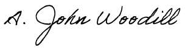

<link rel="stylesheet" href="https://cdn.rawgit.com/jpswalsh/academicons/master/css/academicons.min.css">

 
 

 

<a href="mailto:johnwoodill@gmail.com"> <i class="fa fa-envelope-square fa-3x"></i></a>
<a href="http://johnwoodill.github.io/images/AJohnWoodill_TR_CV.pdf"> <i class="ai ai-cv ai-3x"></i></a>
<a href="https://www.linkedin.com/in/a-john-woodill-21475353/"> <i class="fa fa-linkedin-square fa-3x"></i></a>
<a href="https://www.github.com/johnwoodill"> <i class="fa fa-git-square fa-3x"></i></a>
<a href="https://scholar.google.com/citations?user=FOD51c4AAAAJ&hl=en"> <i class="ai ai-google-scholar-square ai-3x"></i></a>

 

&emsp; I recently graduated with a Ph.D. in Economics from the University of Hawaii. My primary research interest focuses on the economic impact of climate change on agriculture. I have extensive experience modeling and predicting crop yield, revenue, and acres using historical weather/climate data (degree days and time in each degree) and farm-level data, such as available water, soil permeability, and soil class. I’m also familiar with machine/deeping learning methods. Two of my more recent projects include building a Neural Networks to predict crop yield and a Recurrent Neural Networks to predict commodity prices.

&emsp; Aside from climate change research I am also facinated with data science and using machine/deep learning methods to uncover insights into data. Through an economic lens, I am inspired by the many ways to model data that provide insight into decision making and to answer difficult questions. I am amazed at the new technologies in advanced analytics that now allow us to take advantage of big data and make more informed decisions.

Check out my [Technical Resume/CV](http://johnwoodill.github.io/images/AJohnWoodill_TR_CV.pdf), [Data Science Portfolio](https://github.com/johnwoodill/Data-Science-Portfolio), or explore the links at the top of the page to learn more about my interests and experiences.

Feel free to contact me through email.

A. John Woodill

johnwoodill [at] gmail.com

